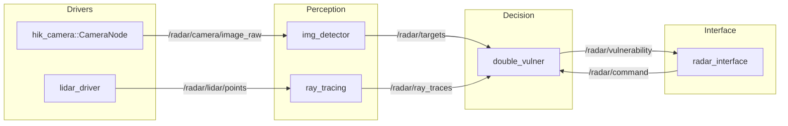

# Robomaster Radar System (ROS 2)

## Package mapping (system layers)

| Layer | Packages | Responsibility |
| --- | --- | --- |
| Drivers | `drivers/hik_camera`, `drivers/lidar_driver` | Sensor acquisition (camera/lidar, lidar scaffold) |
| Perception | `perception/img_detector`, `perception/ray_tracing` | Detection, ray tracing, target extraction |
| Decision | `decision/double_vulner` | Vulnerability evaluation and output selection |
| Interfaces | `interfaces/radar_interface` | Unified messages/services for radar I/O |
| Bringup | `bringup/radar_bringup` | System launch, parameters, diagnostics, rosbag |
| Tools | `tools/test_pkg` | Debug/visualization helpers (camera view) |

## Architecture overview

### TF tree & time sync (baseline)

* TF: `base_link` → `radar_link` → `radar_camera` / `radar_lidar`
* Synchronization: perception nodes use approximate time (camera + lidar) with sensor timestamps; drivers publish with sensor time when available.

## Node list & lifecycle plan

| Package | Node | Type | Lifecycle | Notes |
| --- | --- | --- | --- | --- |
| `hik_camera` | `hik_camera_node` | Component | Managed (future) | Publishes image + camera_info |
| `lidar_driver` | `lidar_node` | Component | Managed (future) | Scaffold package (node pending) |
| `img_detector` | `img_detector_node` | Node/Component | Managed (future) | Outputs target list |
| `ray_tracing` | `ray_tracing_node` | Node/Component | Managed (future) | Outputs ray traces |
| `double_vulner` | `double_vulner_node` | Node/Component | Managed (future) | Outputs vulnerability + status |
| `radar_interface` | `radar_interface_node` | Node/Component | Managed (future) | Bridges commands/status |

## Topics / services (radar_interface)

| Scope | Name | Type | Purpose |
| --- | --- | --- | --- |
| Topic | `/radar/targets` | `radar_interface/msg/RadarTargetArray` | Target list |
| Topic | `/radar/tracking` | `radar_interface/msg/TrackingStateArray` | Tracking state |
| Topic | `/radar/vulnerability` | `radar_interface/msg/VulnerabilityArray` | Vulnerability assessment |
| Topic | `/radar/status` | `radar_interface/msg/RadarStatus` | Diagnostics and status |
| Topic | `/radar/command` | `radar_interface/msg/RadarCommand` | External control command |
| Service | `/radar/set_mode` | `radar_interface/srv/SetRadarMode` | Set radar mode |
| Service | `/radar/reset_tracking` | `radar_interface/srv/ResetTracking` | Reset tracking state |

## Launch files

| Launch file | Purpose |
| --- | --- |
| `radar_bringup/launch/sensors.launch.py` | Start camera component container (lidar placeholder) |
| `radar_bringup/launch/system.launch.py` | Full system shell + TF bootstrap |
| `radar_bringup/launch/monitoring.launch.py` | Diagnostics + optional rosbag2 |
| `radar_bringup/launch/replay.launch.py` | Rosbag2 replay |
| `tools/test_pkg/launch/camera_view.launch.py` | Camera preview (debug) |

## Parameter templates

* `radar_bringup/config/radar_system.yaml` provides parameter scaffolding for drivers, perception, decision, and interface nodes.
* `radar_bringup/config/diagnostic_aggregator.yaml` configures diagnostic aggregation.

## Visualization (rqt + rviz2)

* rqt panel plan: **Radar Monitor**, **Target List**, **Parameter Tuning**, **Diagnostics/Health**.
* RViz2 overlays: target markers (`/radar/targets/markers`) and ray traces (`/radar/ray_traces`).

## Operations & reliability

* Diagnostics: launch `radar_bringup/launch/monitoring.launch.py` to aggregate `/diagnostics`.
* Record/Replay: enable recording via `monitoring.launch.py` or use `ros2 bag record -a` / `ros2 bag play`.
* Performance monitoring: use `ros2 topic hz` and `ros2 topic bw` on key topics.
* Logging: use per-node logging levels (`--ros-args --log-level info`).
* Recovery: drivers expose reconnect or reset services; decision nodes should reset tracking on timeout.
